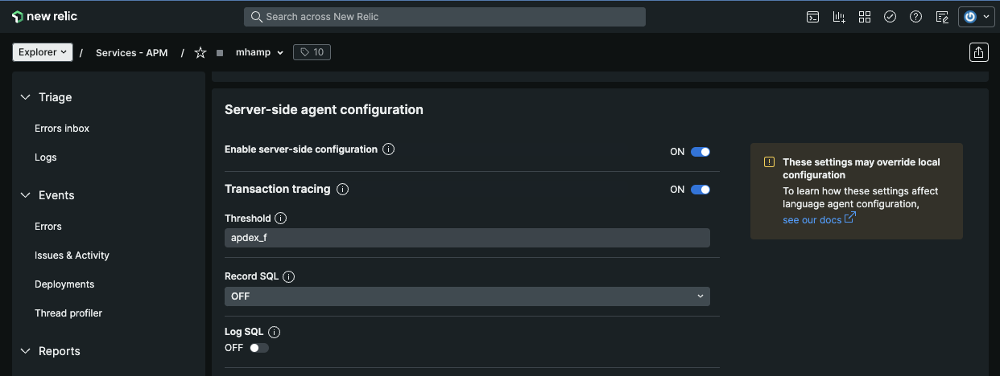

# Setting Server-Side Agent Configuration in NewRelic: Agent Configuration with CloudFormation

The following CloudFormation NewRelic resource types can be useful to set company-specific server-side Agent 
Configuration. This lets infrastructure-as-code, checked in to source control,
be used to onboard- and offboard agents very simply.

We will use the following type:

* `NewRelic::Agent::Configuration` - to create and set the configuration

Typically, the NewRelic agent will be installed on a VM alongside the application being monitored, and configuration
of the agent will be managed with a configuration file on the VM. However, it is also possible to override certain
configuration options server-side once the agent is registered with NewRelic. In this example we will assume that the
agent has been created and registered with NewRelic, but it would also be possible to output the NewRelic GUID in
the creation of e.g. an AWS::EC2::Instance resource.

Here we are configuring the `BrowserConfig` and `SlowSql` settings, along with the ApmConfig `ApdexTarget` setting.

```
---
AWSTemplateFormatVersion: '2010-09-09'
Description: Shows how to set server-side-configuration for a NewRelic Agent
Resources:
  AgentConfigurationSample:
    Type: NewRelic::Agent::Configuration
    Properties:
      Guid: MzUwNDE0M3xBUE18QVBQTElDQVRJT058NDE5OTY3OTEw
      AgentConfiguration:
        Settings:
          Alias: "My Test Alias"
          ApmConfig:
            ApdexTarget: 4
            UseServerSideConfig: true
          BrowserConfig:
            ApdexTarget: 6
          SlowSql:
            Enabled: true

```


### Try It

The complete [example code](example.yaml) is included with this documentation.
Edit the default values, then deploy this in the CloudFormation Console or at the command-line with:

```
aws cloudformation create-stack --stack-name newrelic-agent-configuration --template-body file://example.yaml
```

The following should then be visible in NewRelic:


