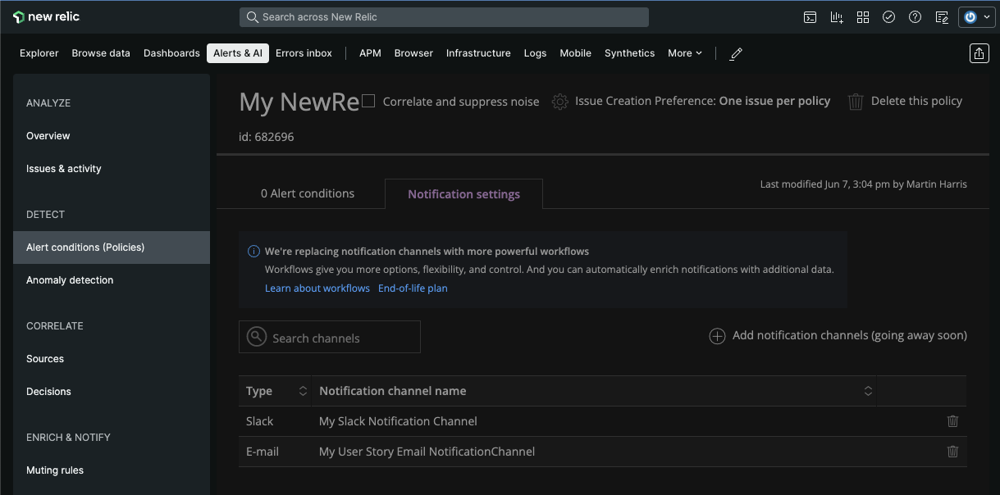

# Creating an Alert Policy in NewRelic: Policies, Notification Channels and Alerts with CloudFormation

The following CloudFormation NewRelic resource types can be useful to create a new Alert Policy with Email and Slack
notification channels, and a Static NRQL Alert Condition. This lets infrastructure-as-code, checked in to source control,
be used to onboard- and offboard policies very simply.

We will use the following types:

* `NewRelic::Alert::AlertsPolicy` - to create and configure the policy
* `NewRelic::Alert::NotificationChannel` - to create and configure the notification channel
* `NewRelic::Alert::PolicyChannelAssociation` - to associate the created channels with the policy
* `NewRelic::Alert::NrqlConditionStatic` - to create and configure the alert condition

First we set the Account ID. This is the account in which all the resources will be created.

```yaml
Parameters:
  AccountId:
    Type: Number
    Default: 3504143
    Description: Enter the ID of your account
```

When creating an alert policy, a name is given and the `IncidentPreference` is also set for the policy. Here we
are using the `IncidentPreference` of `PER_POLICY`. Other options are `PER_CONDITION_AND_TARGET`, and `PER_POLICY`.
The AccountId is taken from the parameters section above.

```yaml
  MyNewPolicy:
    Type: NewRelic::Alert::AlertsPolicy
    Properties:
      AccountId: { Ref: AccountId }
      AlertsPolicy:
        Name: My NewRelic Alerts Policy
        IncidentPreference: PER_POLICY
```

Alert conditions are then created to determine when the policy is triggered. Currently, only Static NR conditions
are supported.

```yaml
  NrqlCondition:
    Type: NewRelic::Alert::NrqlConditionStatic
    Properties:
      AccountId: { Ref: AccountId }
      PolicyId: !GetAtt MyNewPolicy.AlertsPolicyId
      Condition:
        Name: "UserStory Condition"
        Description: "Sample User Story NRQL Condition"
        Enabled: true
        Expiration:
          CloseViolationsOnExpiration: true
          ExpirationDuration: 60
          OpenViolationOnExpiration: true
        Nrql:
          Query: "SELECT count(*) FROM NrAuditEvent"
        Terms:
          Operator: "ABOVE"
          Threshold: 6
          ThresholdDuration: 60
          ThresholdOccurrences: "ALL"
          Priority: "CRITICAL"
```

Finally, two notification channels are created, and `Email` channel, and a `Slack` channel. Other supported channel types
are `WebHook` and `PagerDuty`. These channels are then associated with the policy to notify the desired parties. 
Notification channels can be pre-configured and can be used for multiple policies by
simply replacing the `GetAtt` lookup below with the id of the pre-configured channel.

```yaml
  EmailChannel:
    Type: NewRelic::Alert::NotificationChannel
    Properties:
      AccountId:  { Ref: AccountId }
      Channel:
        Email:
          Emails: [ "test1@mytestdomain.com", "test2@mytestdomain.com" ]
          IncludeJson: true
          Name: "My User Story Email NotificationChannel"

  SlackChannel:
    Type: NewRelic::Alert::NotificationChannel
    Properties:
      AccountId: { Ref: AccountId }
      Channel:
        Slack:
          Name: "My Slack Notification Channel"
          TeamChannel: "#some-test-channel"
          Url: https://hooks.slack.com/services/XXXXXXXXX/YYYYYYYYYYY/ZZZZZZZZZZZZZZZZZZZZZZZZ

  PolicyChannelAssociation:
    Type: NewRelic::Alert::PolicyChannelAssociation
    Properties:
      AccountId: { Ref: AccountId }
      PolicyId: !GetAtt MyNewPolicy.AlertsPolicyId
      ChannelIds: [!GetAtt EmailChannel.ChannelId, !GetAtt SlackChannel.ChannelId]
```

### Try It

The complete [example code](example.yaml) is included with this documentation.
Edit the default values, then deploy this in the CloudFormation Console or at the command-line with:

```
aws cloudformation create-stack --stack-name newrelic-alert-policy --template-body file://example.yaml
```

The following should then be visible in NewRelic:


